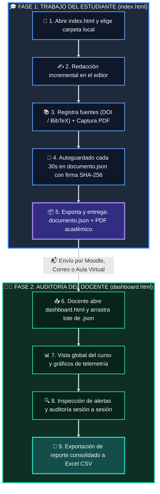

# 🔭 Eye on the Sky (Ojo en el Cielo) 🛰️
### *Plataforma de Escritura Académica Incremental, Citación Científica y Auditoría Docente sin Servidor*

<p align="center">
  
  
  
  
  
  
</p>

---

## 🧭 Tabla de Contenidos

- [🎯 1. ¿Qué es Eye on the Sky?](#-1-qué-es-eye-on-the-sky)
  - [💡 La Filosofía del Proyecto](#-la-filosofía-del-proyecto)
- [✨ 2. Características Principales](#-2-características-principales)
- [🔄 3. Flujo de Trabajo General](#-3-flujo-de-trabajo-general)
- [🚀 4. Instalación y Puesta en Marcha](#-4-instalación-y-puesta-en-marcha)
- [🎓 5. Manual del Estudiante (Editor)](#-5-manual-del-estudiante-editor)
  - [📁 5.1. Abrir o Crear Carpeta de Trabajo](#-51-abrir-o-crear-carpeta-de-trabajo)
  - [✍️ 5.2. Redacción y Telemetría en Vivo](#️-52-redacción-y-telemetría-en-vivo)
  - [📋 5.3. Gestión del Pegado Inicial Masivo](#-53-gestión-del-pegado-inicial-masivo)
  - [📚 5.4. Registro de Fuentes y Citación Científica](#-54-registro-de-fuentes-y-citación-científica)
  - [📸 5.5. Inserción de Capturas de Evidencia (PDFs)](#-55-inserción-de-capturas-de-evidencia-pdfs)
  - [💾 5.6. Autoguardado e Integridad Local](#-56-autoguardado-e-integridad-local)
  - [📦 5.7. Exportaciones para la Entrega](#-57-exportaciones-para-la-entrega)
- [👨‍🏫 6. Manual del Docente (Dashboard de Auditoría)](#-6-manual-del-docente-dashboard-de-auditoría)
  - [📥 6.1. Carga Masiva de Trabajos (.JSON)](#-61-carga-masiva-de-trabajos-json)
  - [📊 6.2. Vista General y Métricas del Curso](#-62-vista-general-y-métricas-del-curso)
  - [📈 6.3. Auditoría del Proceso Incremental (Sesión a Sesión)](#-63-auditoría-del-proceso-incremental-sesión-a-sesión)
  - [🚨 6.4. Sistema Inteligente de Alertas](#-64-sistema-inteligente-de-alertas)
  - [📑 6.5. Exportación de Calificaciones y Reporte CSV](#-65-exportación-de-calificaciones-y-reporte-csv)
- [🛡️ 7. Seguridad y Criptografía (Anti-Manipulación)](#️-7-seguridad-y-criptografía-anti-manipulación)
- [📂 8. Estructura de Archivos del Repositorio](#-8-estructura-de-archivos-del-repositorio)
- [🌐 9. Requisitos y Compatibilidad de Navegadores](#-9-requisitos-y-compatibilidad-de-navegadores)
- [🤝 10. Contribuciones y Soporte](#-10-contribuciones-y-soporte)

---

## 🎯 1. ¿Qué es Eye on the Sky?

**Eye on the Sky** (*Ojo en el Cielo*) es un entorno de trabajo académico ligero, moderno y autónomo diseñado para cursos de investigación y seminarios de grado. 

Resuelve de raíz los dos grandes desafíos de la docencia universitaria actual:
1. 🔍 **Verificar el trabajo genuino de construcción e incremento:** Saber si un estudiante redactó su tesis a lo largo de semanas o si generó/pegó el documento completo de golpe mediante IA la noche anterior.
2. 📖 **Asegurar el rigor científico de las fuentes:** Comprobar que las citas provienen de artículos científicos reales mediante la captura obligatoria del fragmento del PDF consultado.

### 💡 La Filosofía del Proyecto

> [!NOTE]
> **Diseñado para la realidad docente:** 
> 🚫 **Sin bases de datos en la nube ni costos mensuales.**
> 🚫 **Sin servidores que mantener ni registrar cuentas.**
> 💾 **100% Local-First:** El estudiante guarda todo en una carpeta de su propia computadora. El docente analiza el curso completo en segundos simplemente arrastrando los archivos `.json` al dashboard.

---

## ✨ 2. Características Principales

| Módulo | Icono | Funcionalidad Destacada |
| :--- | :---: | :--- |
| **Editor** | 📝 | **Editor enriquecido limpio y libre de distracciones** (tipografía sin serifa moderna, modo oscuro/claro). |
| **Telemetría** | ⏱️ | **Medición en tiempo real** de palabras tecleadas, pulsaciones, eventos de pegado y tiempo activo. |
| **Historial** | 📅 | **Bitácora incremental de sesiones:** Cada día de trabajo queda asentado con fecha, hora, duración y avance neto de palabras. |
| **Bibliografía** | 🏷️ | **Importador DOI (Crossref) y BibTeX** (individual y en lote) con estilos **Chicago** y **APA**. |
| **Evidencia** | 🖼️ | **Capturas de pantalla vinculadas localmente**, sin engordar el JSON con cadenas pesadas en base64. |
| **Dashboard** | 📊 | **Procesamiento en lote:** Carga 10, 50 o 100 archivos JSON simultáneamente y visualiza estadísticas consolidadas. |
| **Alertas** | 🚨 | **Detección automática** de saltos atípicos de palabras, redacción en una sola sesión y manipulación externa. |
| **Exportación** | 📄 | Compatible con **Microsoft Word (.docx)**, **PDF**, **Zotero (.ris)** y reportes para **Excel (.csv)**. |

---

## 🔄 3. Flujo de Trabajo General



### 📋 Resumen Rápido de las Fases:

| Etapa | Responsable | Herramienta | Acción Clave |
| :---: | :---: | :---: | :--- |
| **Paso 1** | 🎓 Estudiante | [`index.html`](file:///d:/Git/app-eye-on-the-sky/index.html) | Selecciona su carpeta de trabajo en disco. Se crea `documento.json` y `capturas/`. |
| **Paso 2** | 🎓 Estudiante | Editor Quill | Escribe el documento en varias sesiones. Se mide telemetría (palabras manuales vs pegados). |
| **Paso 3** | 🎓 Estudiante | Panel Bibliográfico | Agrega artículos científicos con DOI/BibTeX y adjunta la captura de la página del PDF. |
| **Paso 4** | 🎓 Estudiante | Menú Exportar | Genera el **PDF imprimible** y el archivo **documento.json** con firma digital. |
| **Paso 5** | 👨‍🏫 Docente | [`dashboard.html`](file:///d:/Git/app-eye-on-the-sky/dashboard.html) | Arrastra todos los `.json` del grupo. Recibe diagnóstico inmediato, alertas y bitácora. |

---

## 🚀 4. Instalación y Puesta en Marcha

Eye on the Sky **no requiere `npm install`, NodeJS, Python ni servidores backend**. Funciona de inmediato como una aplicación web estática:

### 🟢 Opción A: Abrir directamente en el navegador
1. Clona o descarga este repositorio:
   ```bash
   git clone https://github.com/tu-usuario/app-eye-on-the-sky.git
   ```
2. Haz doble clic en [`index.html`](file:///d:/Git/app-eye-on-the-sky/index.html) para el **Editor del Estudiante**.
3. Haz doble clic en [`dashboard.html`](file:///d:/Git/app-eye-on-the-sky/dashboard.html) para el **Dashboard del Docente**.

### 🟡 Opción B: Ejecutar con Live Server (VS Code / Antigravity)
- Haz clic derecho sobre `index.html` y selecciona **Open with Live Server**.

### 🔵 Opción C: Desplegar en la Web (GitHub Pages / Vercel / Netlify)
- Sube este repositorio a GitHub y activa **GitHub Pages** en la rama principal. ¡La app funcionará en línea de inmediato sin costos de hosting!

---

## 🎓 5. Manual del Estudiante (Editor)

El editor se encuentra en el archivo [`index.html`](file:///d:/Git/app-eye-on-the-sky/index.html).

### 📁 5.1. Abrir o Crear Carpeta de Trabajo

Al ingresar, un asistente te invitará a elegir tu carpeta de trabajo local:
- 🆕 **Crear nuevo proyecto:** Crea automáticamente una subcarpeta llamada `capturas/` y el archivo `documento.json`.
- 📂 **Abrir proyecto existente:** Abre una carpeta previamente creada, restaurando el texto, las fuentes registradas y la bitácora histórica de sesiones.

> [!IMPORTANT]
> **Permiso de acceso a archivos:** Cuando tu navegador (Chrome o Edge) te pregunte si deseas otorgar permisos de lectura y escritura a la carpeta, haz clic en **"Permitir"**. Esto habilita el autoguardado local transparente.

---

### ✍️ 5.2. Redacción y Telemetría en Vivo

En la barra lateral derecha (*Telemetría*) y en la barra inferior de estado se monitoriza tu trabajo:

- 🟢 **Escritura manual (% Salud):** Muestra el porcentaje de texto producido mediante digitación directa en el teclado frente a bloques pegados.
- ✍️ **Palabras escritas:** Conteo de palabras redactadas manualmente en la sesión activa.
- 📋 **Eventos de pegado:** Número de veces que se ha pegado texto externo.
- ⏳ **Tiempo activo:** Cronómetro de la sesión en curso.
- 📆 **Totales del proyecto:** Días de trabajo acumulados y sesiones totales registradas.

---

### 📋 5.3. Gestión del Pegado Inicial Masivo

Sabemos que muchas veces los estudiantes inician un trabajo a partir de notas previas o borradores ya construidos:

- 🎁 **Pegado Inicial Exento:** Si el editor está completamente en blanco y realizas un pegado masivo inicial de tus notas previas, la aplicación **no lo penaliza**. Aparecerá una notificación verde indicando que el texto fue aceptado como punto de partida sin afectar negativamente tu porcentaje de escritura manual.
- ⚠️ **Pegados posteriores:** Cualquier pegado efectuado durante el desarrollo del texto será registrado con su volumen de caracteres y fecha para control docente.

---

### 📚 5.4. Registro de Fuentes y Citación Científica

Haz clic en **"Agregar fuente"** (o el botón `+` en la barra lateral izquierda):

1. 🔍 **Búsqueda por DOI:** Escribe el DOI (ejemplo: `10.1016/j.jclinepi.2020.06.014`) y haz clic en **"Buscar"**. La app consultará la API de Crossref y completará título, autores, año y revista automáticamente.
2. 📥 **Importación BibTeX (Individual o en Lote):** Pega una o decenas de entradas BibTeX (exportadas de Scopus, Web of Science, Google Scholar o Zotero) en la pestaña **"Importar BibTeX"** y haz clic en **"Importar entradas"**.
3. 📝 **Cita en el texto:** Haz clic en **"Citar"** para insertar automáticamente la cita en formato **Chicago (Nota al pie)**, **Chicago (Autor-Año)** o **APA 7ma edición**.

---

### 📸 5.5. Inserción de Capturas de Evidencia (PDFs)

Para demostrar que un artículo científico fue leído y consultado legítimamente:

1. Al dar de alta una fuente, arrastra o sube una captura de pantalla de la página del PDF donde se encuentra el párrafo que estás citando.
2. La imagen se guarda en tu carpeta local `capturas/` con un nombre único y normalizado (ej. `capturas/src-123-evidencia.png`).
3. Puedes hacer clic en **"Insertar captura"** en la barra superior para incrustar la imagen en el documento con su pie de foto correspondiente.

> [!TIP]
> **Eficiencia y ligereza:** Las imágenes nunca se convierten en texto pesado (base64) dentro del JSON; quedan en tu carpeta local como imágenes independientes, garantizando un archivo JSON ligero y ultra veloz.

---

### 💾 5.6. Autoguardado e Integridad Local

- 🔄 **Autoguardado cada 30 segundos:** La aplicación graba tu progreso de forma automática.
- 👁️ **Guardado al cambiar de pestaña:** Si minimizas la ventana o cambias de pestaña, el sistema guarda de inmediato.
- ⌨️ **Atajo directo:** Puedes presionar <kbd>Ctrl</kbd> + <kbd>S</kbd> (o <kbd>Cmd</kbd> + <kbd>S</kbd> en Mac) en cualquier momento.
- 🔒 **Firma criptográfica:** Cada guardado recalcula una firma digital **SHA-256** dentro de `_signature` para certificar que el archivo no fue manipulado a mano con un editor de texto.

---

### 📦 5.7. Exportaciones para la Entrega

Desde el menú **Exportar**:
- 📄 **Exportar a PDF:** Genera la vista de impresión académica con todas las citas e imágenes incrustadas.
- 📝 **Exportar a Word (.docx):** Descarga el manuscrito listo para abrir en Microsoft Word.
- 🗃️ **Bibliografía para Zotero (.ris):** Descarga tus fuentes en formato estándar RIS para importarlas a tu biblioteca de Zotero con un solo clic.
- 💾 **Descargar copia JSON:** Genera un duplicado de respaldo de tu archivo `documento.json`.

---

## 👨‍🏫 6. Manual del Docente (Dashboard de Auditoría)

El panel del profesor se encuentra en [`dashboard.html`](file:///d:/Git/app-eye-on-the-sky/dashboard.html).

### 📥 6.1. Carga Masiva de Trabajos (.JSON)

1. Abre [`dashboard.html`](file:///d:/Git/app-eye-on-the-sky/dashboard.html) en tu navegador.
2. Arrastra todos los archivos `.json` que te hayan enviado tus estudiantes a la zona de carga (o haz clic en **"Seleccionar carpeta de entregas"**).
3. En menos de un segundo, el dashboard procesa y audita todos los proyectos en lote.

---

### 📊 6.2. Vista General y Métricas del Curso

El panel principal calcula instantáneamente indicadores clave para toda la clase:

- 👥 **Total de estudiantes evaluados.**
- 📝 **Promedio de palabras por manuscrito.**
- ✍️ **Porcentaje promedio de redacción manual.**
- 📸 **Porcentaje de fuentes respaldadas con captura.**
- 📅 **Promedio de sesiones dedicadas por estudiante.**
- 📊 **Gráficos interactivos:** Distribución de originalidad del texto y dispersión de sesiones de trabajo.

---

### 📈 6.3. Auditoría del Proceso Incremental (Sesión a Sesión)

Al hacer clic en cualquier estudiante de la tabla, se abre su expediente de auditoría:

```
Evolución incremental:
[S1: 12-sep] 0 ➔ 320 pal. (+320)  ➔  [S2: 15-sep] 320 ➔ 640 pal. (+320)  ➔  [S3: 20-sep] 640 ➔ 1,020 pal. (+380)
```

En la pestaña **Historial de Sesiones**, se despliega una tabla con auditoría segundo a segundo:
- 🔢 **Número de sesión:** Secuencia cronológica (1, 2, 3...).
- 📅 **Fecha y Horario:** Cuándo se conectó el estudiante (ejemplo: `20/09/2026 14:10 – 14:55`).
- ⏱️ **Duración:** Tiempo efectivo invertido.
- 📈 **Progreso de palabras:** Conteo inicial ➔ conteo final y saldo neto ganado.
- ⌨️ **Texto manual vs Pegados:** Cuántas palabras escribió a mano y cuántos caracteres pegó en esa jornada.
- 🔤 **Pulsaciones reales:** Registro de pulsaciones de teclado asociadas.

---

### 🚨 6.4. Sistema Inteligente de Alertas

El sistema califica automáticamente el riesgo de cada trabajo:

| Nivel | Icono | Tipo de Alerta | Causa / Diagnóstico |
| :---: | :---: | :--- | :--- |
| **Peligro** | 🚨 | **Documento realizado en 1 sesión** | El documento tiene cientos o miles de palabras pero solo registra 1 sesión de trabajo (típico volcado de IA o compra de tesis). |
| **Peligro** | 🚨 | **Baja escritura manual (< 40%)** | Más del 60% del documento fue producto de operaciones de pegado masivo. |
| **Peligro** | 🚨 | **Cero fuentes con captura** | Ninguna de las fuentes bibliográficas citadas incluye evidencia visual de lectura. |
| **Advertencia** | ⚠️ | **Salto atípico en sesión X** | Aumento brusco de texto (+400 palabras en pocos minutos a un ritmo > 65 palabras/min). |
| **Advertencia** | ⚠️ | **Pocos días activos para el volumen** | Documentos extensos (> 1,000 palabras) confeccionados en 1 solo día. |
| **Advertencia** | ⚠️ | **Modificación manual del JSON** | La firma criptográfica SHA-256 no coincide; el alumno intentó alterar las telemetrías con un editor de texto. |
| **Correcto** | 🟢 | **Sin alertas** | Muestra consistencia incremental, sesiones distribuidas y fuentes respaldadas. |

---

### 📑 6.5. Exportación de Calificaciones y Reporte CSV

Haz clic en **"Exportar reporte CSV"** en la esquina superior del dashboard:
- Descarga una planilla compatible con **Microsoft Excel** y **Google Sheets** (incluye codificación UTF-8 con BOM).
- Contiene por columnas: Estudiante, Título, Sesiones, Días activos, % Manual, Caracteres pegados, Fuentes totales, Con captura, Citadas en texto, Total palabras, Nivel de alerta, Diagnóstico detallado y Estado de integridad criptográfica.

---

## 🛡️ 7. Seguridad y Criptografía (Anti-Manipulación)

Para evitar que un estudiante altere su archivo `documento.json` para falsear el número de sesiones o el porcentaje de escritura manual:


---

## 📂 8. Estructura de Archivos del Repositorio

```plaintext
app-eye-on-the-sky/
│
├── 📄 index.html           # Interfaz del Editor del Estudiante
├── 📄 dashboard.html       # Interfaz del Dashboard del Docente
├── 📄 README.md            # Manual de usuario y documentación técnica
│
├── 📁 css/
│   └── 🎨 styles.css       # Sistema de diseño completo (Dark/Light, Glassmorphism, CSS Grid)
│
└── 📁 js/
    ├── ⚙️ editor.js        # Motor del editor, File System API, telemetría y exportaciones
    └── 📊 dashboard.js     # Motor de análisis en lote, gráficos Chart.js y auditoría
```

---

## 🌐 9. Requisitos y Compatibilidad de Navegadores

| Navegador | Soporte Editor (File System Access) | Soporte Dashboard Docente |
| :--- | :---: | :---: |
| 🌐 **Google Chrome** (v86+) | 🟢 **100% Nativo** | 🟢 **100% Nativo** |
| 🌐 **Microsoft Edge** (v86+) | 🟢 **100% Nativo** | 🟢 **100% Nativo** |
| 🌐 **Brave Browser** | 🟢 **100% Nativo** | 🟢 **100% Nativo** |
| 🌐 **Opera** (v72+) | 🟢 **100% Nativo** | 🟢 **100% Nativo** |
| 🌐 **Mozilla Firefox** | 🟡 Modo Respaldo JSON | 🟢 **100% Nativo** (Carga de archivos) |
| 🌐 **Apple Safari** | 🟡 Modo Respaldo JSON | 🟢 **100% Nativo** (Carga de archivos) |

> [!NOTE]
> Para la mejor experiencia de autoguardado directo en carpetas locales en el **Editor**, se recomienda utilizar **Google Chrome** o **Microsoft Edge**. El **Dashboard del Docente** funciona perfectamente en cualquier navegador moderno.

---

## 🤝 10. Contribuciones y Soporte

Las sugerencias, mejoras y reportes de errores son bienvenidos:

1. Haz un **Fork** de este repositorio.
2. Crea una rama para tu característica: `git checkout -b feature/nueva-mejora`.
3. Haz commit de tus cambios: `git commit -m 'feat: Agregar nueva funcionalidad'`.
4. Haz push a la rama: `git push origin feature/nueva-mejora`.
5. Abre un **Pull Request**.

---

<p align="center">
  <b>Eye on the Sky</b> • Desarrollado con ❤️ para docentes y estudiantes de investigación.<br>
  <i>Fomentando la honestidad académica y el rigor científico sin barreras tecnológicas.</i>
</p>
