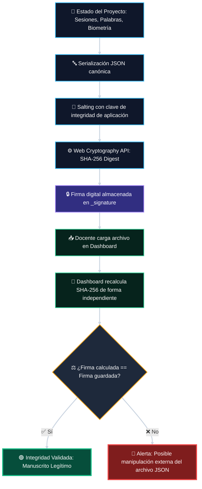

# 🔭 Eye on the Sky (Ojo en el Cielo) 🛰️
### *Plataforma de Escritura Académica Incremental, Citación Científica, Biometría de Redacción y Auditoría Docente sin Servidor*

<p align="center">
  
  
  
  
  
  
  
  
</p>

---

## 🧭 Tabla de Contenidos

- [🎯 1. ¿Qué es Eye on the Sky?](#-1-qué-es-eye-on-the-sky)
  - [💡 La Filosofía del Proyecto](#-la-filosofía-del-proyecto)
- [✨ 2. Características Principales](#-2-características-principales)
- [🔄 3. Flujo de Trabajo General](#-3-flujo-de-trabajo-general)
- [🚀 4. Instalación y Puesta en Marcha](#-4-instalación-y-puesta-en-marcha)
- [🎓 5. Manual del Estudiante (Editor)](#-5-manual-del-estudiante-editor)
  - [📁 5.1. Abrir o Crear Carpeta / Archivo de Trabajo](#-51-abrir-o-crear-carpeta--archivo-de-trabajo)
  - [✍️ 5.2. Redacción y Telemetría en Vivo](#️-52-redacción-y-telemetría-en-vivo)
  - [🎨 5.3. Mapa de Colores de Procedencia del Texto (Auditoría Visual)](#-53-mapa-de-colores-de-procedencia-del-texto-auditoría-visual)
  - [🔒 5.4. Biometría de Escritura (Huella Digital de Tecleo)](#-54-biometría-de-escritura-huella-digital-de-tecleo)
  - [📋 5.5. Gestión del Pegado Inicial Masivo](#-55-gestión-del-pegado-inicial-masivo)
  - [🔊 5.6. Gamificación y Efectos de Sonido](#-56-gamificación-y-efectos-de-sonido)
  - [📚 5.7. Registro de Fuentes y Citación Científica](#-57-registro-de-fuentes-y-citación-científica)
  - [📸 5.8. Inserción de Capturas de Evidencia (PDFs)](#-58-inserción-de-capturas-de-evidencia-pdfs)
  - [💾 5.9. Autoguardado e Integridad Criptográfica Local](#-59-autoguardado-e-integridad-criptográfica-local)
  - [📦 5.10. Exportaciones para la Entrega](#-510-exportaciones-para-la-entrega)
- [👨‍🏫 6. Manual del Docente (Dashboard de Auditoría)](#-6-manual-del-docente-dashboard-de-auditoría)
  - [📥 6.1. Carga Masiva de Trabajos (.JSON)](#-61-carga-masiva-de-trabajos-json)
  - [📊 6.2. Vista General y Métricas del Curso](#-62-vista-general-y-métricas-del-curso)
  - [📈 6.3. Auditoría del Proceso Incremental (Sesión a Sesión)](#-63-auditoría-del-proceso-incremental-sesión-a-sesión)
  - [🎯 6.4. Auditoría Biométrica y Detección de Suplantación de Autor](#-64-auditoría-biométrica-y-detección-de-suplantación-de-autor)
  - [🚨 6.5. Sistema Inteligente de Alertas](#-65-sistema-inteligente-de-alertas)
  - [📑 6.6. Exportación a Excel / Google Sheets (CSV)](#-66-exportación-a-excel--google-sheets-csv)
  - [📧 6.7. Envío Masivo de Reportes Gráficos por Correo (Google Sheets + Apps Script)](#-67-envío-masivo-de-reportes-gráficos-por-correo-google-sheets--apps-script)
  - [🧪 6.8. Banco de Pruebas: Estudiantes Demo](#-68-banco-de-pruebas-estudiantes-demo)
- [🛡️ 7. Seguridad y Criptografía (Anti-Manipulación)](#️-7-seguridad-y-criptografía-anti-manipulación)
- [📂 8. Estructura de Archivos del Repositorio](#-8-estructura-de-archivos-del-repositorio)
- [🌐 9. Requisitos y Compatibilidad de Navegadores](#-9-requisitos-y-compatibilidad-de-navegadores)
- [🤝 10. Contribuciones y Soporte](#-10-contribuciones-y-soporte)

---

## 🎯 1. ¿Qué es Eye on the Sky?

**Eye on the Sky** (*Ojo en el Cielo*) es un entorno de trabajo académico ligero, moderno y autónomo diseñado especialmente para cursos de investigación, seminarios de tesis y talleres de grado.

Resuelve de raíz los dos mayores dilemas de la docencia universitaria contemporánea:
1. 🔍 **Verificar el trabajo genuino de construcción e incremento:** Comprobar si un estudiante redactó su manuscrito a lo largo de días y semanas mediante pulsaciones reales en el teclado, o si generó/pegó el documento completo de golpe mediante Inteligencia Artificial (ChatGPT, Claude, etc.) la noche anterior a la entrega.
2. 📖 **Asegurar el rigor científico de las fuentes:** Verificar que las citas bibliográficas no son referencias inventadas o alucinadas por LLMs, exigiendo al estudiante la captura obligatoria de la página del PDF científico donde se sustenta el párrafo citado.
3. 🎯 **Certificar la autoría continua mediante biometría de tecleo:** Medir los micro-ritmos de pulsación del estudiante (*dwell time* y *flight time*) para constatar que siempre es la misma persona quien redacta sesión a sesión y alertar si otra persona o servicio de terceros redactó partes del documento.

### 💡 La Filosofía del Proyecto

> [!NOTE]
> **Diseñado para la realidad docente latinoamericana:** 
> 🚫 **Sin bases de datos en la nube ni costos mensuales recurrentes.**  
> 🚫 **Sin servidores SMTP complejos que caigan en carpetas de Spam.**  
> 💾 **100% Local-First:** El estudiante guarda todo en una carpeta de su propia computadora. El docente analiza el curso completo en segundos simplemente arrastrando los archivos `.json` al dashboard.  
> 📧 **Integración nativa con Google Sheets y Google Apps Script:** Permite enviar correos masivos con diseño gráfico profesional usando directamente la cuota gratuita de Gmail/Google Workspace institucional.

---

## ✨ 2. Características Principales

| Módulo | Icono | Funcionalidad Destacada |
| :--- | :---: | :--- |
| **Editor** | 📝 | **Editor enriquecido limpio y libre de distracciones** con tipografía moderna sin serifa, modo oscuro/claro y atajos directos. |
| **Mapa de Colores** | 🎨 | **Codificación visual de procedencia del texto:** Resalta con la paleta del dashboard el texto pegado externo (rojo), pegado inicial exento (azul) y citas científicas (púrpura), con botón de ocultar para lectura limpia. |
| **Biometría de Escritura** | 🔒 | **Dinámica de tecleo (Keystroke Dynamics):** Mide permanencia en tecla (*dwell time*) y pausas de vuelo (*flight time*). Calibra una huella digital a las 250 pulsaciones y evalúa la consistencia de autoría sesión tras sesión. |
| **Gamificación Sonora** | 🔊 | **Efectos de audio:** Feedback sonoro sutil al teclear, pegar texto, insertar citas, calibrar la huella y alcanzar hitos de palabras. |
| **Telemetría** | ⏱️ | **Medición en tiempo real** de palabras tecleadas, pulsaciones, eventos de pegado y tiempo activo. |
| **Historial** | 📅 | **Bitácora incremental de sesiones:** Cada día de trabajo queda asentado con fecha, hora, duración y avance neto de palabras. |
| **Bibliografía** | 🏷️ | **Importador DOI (Crossref) y BibTeX** (individual y en lote) con estilos **Chicago** y **APA**. |
| **Evidencia** | 🖼️ | **Capturas de pantalla vinculadas localmente**, sin engordar el JSON con cadenas pesadas en base64. |
| **Dashboard** | 📊 | **Procesamiento en lote:** Carga 10, 50 o 100 archivos JSON simultáneamente y visualiza estadísticas consolidadas. |
| **Alertas** | 🚨 | **Detección automática** de saltos atípicos de palabras, redacción en una sola sesión, discrepancia biométrica y manipulación externa. |
| **Correo Masivo Gráfico** | 📧 | **Google Apps Script incluido (`codigo_apps_script.gs`):** Envío masivo automatizado desde Google Sheets de tarjetas de progreso HTML responsivas a cada alumno sin servidor SMTP. |
| **Exportación** | 📄 | Compatible con **Microsoft Word (.docx)**, **PDF**, **Zotero (.ris)** y reportes para **Excel / Google Sheets (.csv)**. |

---

## 🔄 3. Flujo de Trabajo General

```mermaid
flowchart TD
    subgraph S1["🎓 FASE 1: TRABAJO DEL ESTUDIANTE (index.html)"]
        direction TB
        A["📁 1. Abre index.html y elige carpeta local o .json"] --> B["✍️ 2. Redacción incremental en el editor"]
        B --> C["🔒 3. Calibración biométrica de tecleo (250 pulsaciones)"]
        C --> D["🎨 4. Mapa de colores visualiza procedencia (escritura vs pegado)"]
        D --> E["📚 5. Registra fuentes (DOI / BibTeX) + Captura PDF"]
        E --> F["💾 6. Autoguardado cada 30s en documento.json con firma SHA-256"]
        F --> G["📦 7. Exporta y entrega: documento.json + PDF académico"]
    end

    subgraph S2["👨‍🏫 FASE 2: AUDITORÍA DOCENTE (dashboard.html)"]
        direction TB
        H["📥 8. Docente abre dashboard.html y arrastra lote de .json"] --> I["📊 9. Vista global del curso, gráficos y biometría"]
        I --> J["🔍 10. Inspección de alertas, autoría y sesiones"]
        J --> K["📑 11. Exporta reporte consolidado CSV"]
    end

    subgraph S3["📧 FASE 3: RETROALIMENTACIÓN MASIVA (Google Sheets + Apps Script)"]
        direction TB
        L["📋 12. Fusiona CSV con Google Sheets existente del profesor"] --> M["⚙️ 13. Pega codigo_apps_script.gs en Extensiones > Apps Script"]
        M --> N["🚀 14. Menú '🎓 Eye on the Sky' > Envío masivo por Gmail"]
        N --> O["📬 15. Estudiante recibe correo gráfico con tarjeta HTML de métricas"]
    end

    G ==>|"Envío por Moodle, Correo o Aula Virtual"| H
    K ==>|"Importar CSV"| L

    %% Estilos de alto contraste para GitHub
    style S1 fill:#1e293b,stroke:#3b82f6,stroke-width:3px,color:#f8fafc
    style S2 fill:#0f2e24,stroke:#10b981,stroke-width:3px,color:#f8fafc
    style S3 fill:#312e81,stroke:#8b5cf6,stroke-width:3px,color:#f8fafc

    style A fill:#0f172a,stroke:#60a5fa,stroke-width:2px,color:#ffffff
    style B fill:#0f172a,stroke:#60a5fa,stroke-width:2px,color:#ffffff
    style C fill:#0f172a,stroke:#60a5fa,stroke-width:2px,color:#ffffff
    style D fill:#0f172a,stroke:#60a5fa,stroke-width:2px,color:#ffffff
    style E fill:#0f172a,stroke:#60a5fa,stroke-width:2px,color:#ffffff
    style F fill:#0f172a,stroke:#60a5fa,stroke-width:2px,color:#ffffff
    style G fill:#2e1065,stroke:#a78bfa,stroke-width:3px,color:#ffffff

    style H fill:#06231c,stroke:#34d399,stroke-width:2px,color:#ffffff
    style I fill:#06231c,stroke:#34d399,stroke-width:2px,color:#ffffff
    style J fill:#06231c,stroke:#34d399,stroke-width:2px,color:#ffffff
    style K fill:#134e4a,stroke:#2dd4bf,stroke-width:3px,color:#ffffff

    style L fill:#1e1b4b,stroke:#c084fc,stroke-width:2px,color:#ffffff
    style M fill:#1e1b4b,stroke:#c084fc,stroke-width:2px,color:#ffffff
    style N fill:#1e1b4b,stroke:#c084fc,stroke-width:2px,color:#ffffff
    style O fill:#4c1d95,stroke:#e9d5ff,stroke-width:3px,color:#ffffff

    linkStyle default stroke:#cbd5e1,stroke-width:3px
```



---

## 🚀 4. Instalación y Puesta en Marcha

Eye on the Sky **no requiere `npm install`, NodeJS, bases de datos ni configuración de servidores**. Funciona de inmediato como una aplicación web nativa:

### 🟢 Opción A: Abrir directamente en el navegador
1. Clona o descarga este repositorio:
   ```bash
   git clone https://github.com/tu-usuario/app-eye-on-the-sky.git
   ```
2. Haz doble clic en [`index.html`](file:///d:/Git/app-eye-on-the-sky/index.html) para el **Editor del Estudiante**.
3. Haz doble clic en [`dashboard.html`](file:///d:/Git/app-eye-on-the-sky/dashboard.html) para el **Dashboard del Docente**.

### 🟡 Opción B: Ejecutar con Live Server (VS Code / Antigravity)
- Haz clic derecho sobre `index.html` y selecciona **Open with Live Server**.

### 🔵 Opción C: Desplegar en la Web (GitHub Pages / Vercel)
- Sube el repositorio a GitHub y activa **GitHub Pages** en la rama principal. ¡La app funcionará en la nube sin costo de hosting!

---

## 🎓 5. Manual del Estudiante (Editor)

La interfaz del estudiante se encuentra en [`index.html`](file:///d:/Git/app-eye-on-the-sky/index.html).

### 📁 5.1. Abrir o Crear Carpeta / Archivo de Trabajo

Al ingresar, una ventana de bienvenida ofrece opciones flexibles:
- 🆕 **Crear nuevo proyecto:** Permite seleccionar una carpeta local vacía. El editor crea automáticamente la subcarpeta `capturas/` y el archivo `documento.json`.
- 📂 **Abrir carpeta existente:** Permite seleccionar la carpeta de un trabajo previo. La app detecta automáticamente cualquier archivo `.json` de Eye on the Sky presente en ella.
- 📄 **Cargar archivo .json directamente:** Si el navegador no soporta File System Access API o prefieres trabajar con un archivo individual, puedes hacer clic en *"O cargar archivo JSON directamente"* para seleccionarlo desde el explorador de Windows/Mac.

> [!IMPORTANT]
> **Permiso de acceso a archivos:** Cuando tu navegador (Chrome o Edge) te pregunte si deseas otorgar permisos de lectura y escritura a la carpeta, haz clic en **"Permitir"**. Esto habilita el autoguardado transparente en tu disco duro.

---

### ✍️ 5.2. Redacción y Telemetría en Vivo

En la barra lateral derecha (*Telemetría*) y en la barra inferior de estado se monitoriza el proceso:
- 🟢 **Escritura manual (% Salud):** Muestra el porcentaje de texto producido mediante digitación directa frente a pegados.
- ✍️ **Palabras escritas:** Conteo de palabras redactadas manualmente en la sesión activa.
- 📋 **Eventos de pegado:** Veces que se ha introducido texto externo.
- ⏳ **Tiempo activo:** Cronómetro de la sesión en curso.
- 📆 **Totales del proyecto:** Días de trabajo acumulados y sesiones totales registradas.

---

### 🎨 5.3. Mapa de Colores de Procedencia del Texto (Auditoría Visual)

Para que el estudiante comprenda el significado de las métricas del dashboard mientras redacta, el editor incorpora un **sistema de colores en vivo**:

| Color de Resaltado | Significado y Tipo de Actividad | Impacto en Telemetría |
| :--- | :--- | :--- |
| <span style="background:#fee2e2; color:#991b1b; padding:2px 8px; border-radius:4px; font-weight:700;">🔴 Rojo / Salmón</span> | **Texto pegado externo:** Texto proveniente del portapapeles (páginas web, IA, otros documentos). | Registra evento de pegado y reduce el % de escritura manual. |
| <span style="background:#dbeafe; color:#1e40af; padding:2px 8px; border-radius:4px; font-weight:700;">🔵 Azul suave</span> | **Pegado inicial exento:** Bloque de notas o apuntes pegados al iniciar el documento vacío. | **Exento:** No penaliza el puntaje de salud del trabajo. |
| <span style="background:#f3e8ff; color:#6b21a8; padding:2px 8px; border-radius:4px; font-weight:700;">🟣 Púrpura suave</span> | **Citas científicas insertadas:** Referencias bibliográficas agregadas desde el panel de fuentes. | Reconocido como práctica científica legítima. |
| <span style="background:#f8fafc; color:#334155; padding:2px 8px; border-radius:4px; font-weight:700;">⚪ Fondo limpio</span> | **Redacción manual genuina:** Caracteres digitados directamente por el estudiante en su teclado. | Incrementa el porcentaje de salud y palabras manuales. |

#### 🕶️ Modo de Lectura Limpia
En la barra lateral derecha, en la sección **"Procedencia del texto"**, encontrarás el botón:
- **"🕶️ Ocultar colores" / "👁️ Ver colores":** Permite al estudiante apagar visualmente los resaltados para leer su manuscrito con total comodidad, sin alterar los metadatos de auditoría guardados en el archivo.

---

### 🔒 5.4. Biometría de Escritura (Huella Digital de Tecleo)

Para asegurar que el documento siempre está siendo redactado por el mismo autor, Eye on the Sky incorpora un motor de **dinámica de tecleo (*Keystroke Dynamics*)**:

1. **Captura de métricas fisiológicas:**
   - ⏱️ **Dwell Time:** Tiempo exacto en milisegundos que el dedo presiona una tecla antes de soltarla.
   - ⏸️ **Flight Time:** Pausa en milisegundos entre soltar una tecla y presionar la siguiente.
   - ␣ **Pulsación de espacio y retroceso:** Tiempos característicos de pausa de pensamiento y corrección de errores.
2. **Calibración a las 250 pulsaciones:**
   - Durante las primeras 250 pulsaciones manuales del estudiante, el sistema calibra la línea base (*baseline*) del autor.
   - Al completarse, se despliega una ventana modal notificando:
     > *"🎯 ¡Huella Digital de Escritura Calibrada! Se ha registrado el patrón único de tecleo para certificar la autoría de este trabajo."*
3. **Monitoreo sesión a sesión:**
   - Cada nueva sesión compara el vector de pulsaciones contra la huella calibrada y calcula un índice de consistencia (0% a 100%).

---

### 📋 5.5. Gestión del Pegado Inicial Masivo

Sabemos que muchos estudiantes inician un trabajo a partir de notas previas o esquemas construidos con anterioridad:
- 🎁 **Pegado Inicial Exento:** Si el editor está en blanco y se pega un borrador inicial de notas, la aplicación **no lo penaliza**. Se notifica con un toast verde que el texto fue aceptado como punto de partida sin afectar negativamente la calificación de salud manual.
- ⚠️ **Pegados posteriores:** Cualquier pegado efectuado durante el desarrollo del texto será registrado con su volumen de caracteres y fecha para control docente.

---

### 🔊 5.6. Gamificación y Efectos de Sonido

El editor incluye retroalimentación auditiva para potenciar la concentración y premiar el avance:
- 📁 **Carpeta local:** Los sonidos se ubican en la carpeta `Sounds/`. La aplicación utiliza una lista blanca estricta e ignora cualquier archivo con nombres no autorizados.

| Archivo | Evento Disparador | Propósito Pedagógico |
| :--- | :--- | :--- |
| `typing_keystroke.mp3` | Tecleo manual continuo | Refuerzo táctil y sensación de máquina de escribir moderna. |
| `paste_warning.mp3` | Pegado de texto externo | Advertencia sutil de que el pegado queda registrado en auditoría. |
| `citation_success.mp3` | Inserción de cita bibliográfica | Recompensa auditiva por respaldar una afirmación con evidencia. |
| `session_start.mp3` | Inicio de nueva sesión de trabajo | Establece el inicio del bloque de concentración. |
| `milestone_words.mp3` | Alcanzar cada 500 palabras manuales | Celebración del progreso incremental del manuscrito. |
| `calibration_complete.mp3` | Certificación de huella biométrica | Notificación de que el perfil de autor ha sido asegurado. |

---

### 📚 5.7. Registro de Fuentes y Citación Científica

Haz clic en **"Agregar fuente"** (o el botón `+` en la barra lateral izquierda):
1. 🔍 **Búsqueda por DOI:** Escribe el DOI (ejemplo: `10.1016/j.jclinepi.2020.06.014`) y haz clic en **"Buscar"**. La app consultará la API de Crossref y completará título, autores, año y revista automáticamente.
2. 📥 **Importación BibTeX (Individual o en Lote):** Pega una o decenas de entradas BibTeX (exportadas de Scopus, Web of Science, Google Scholar o Zotero) en la pestaña **"Importar BibTeX"** y haz clic en **"Importar entradas"**.
3. 📝 **Cita en el texto:** Haz clic en **"Citar"** para insertar automáticamente la cita en formato **Chicago (Nota al pie)**, **Chicago (Autor-Año)** o **APA 7ma edición**.

---

### 📸 5.8. Inserción de Capturas de Evidencia (PDFs)

Para demostrar que un artículo científico fue leído y consultado legítimamente:
1. Al dar de alta una fuente, arrastra o sube una captura de pantalla de la página del PDF donde se encuentra el párrafo que estás citando.
2. La imagen se guarda en tu carpeta local `capturas/` con un nombre único y normalizado (ej. `capturas/src-123-evidencia.png`).
3. Puedes hacer clic en **"Insertar captura"** en la barra superior para incrustar la imagen en el documento con su pie de foto correspondiente.

---

### 💾 5.9. Autoguardado e Integridad Criptográfica Local

- 🔄 **Autoguardado cada 30 segundos:** La aplicación graba tu progreso de forma automática en `documento.json`.
- 👁️ **Guardado al cambiar de pestaña:** Si minimizas la ventana o cambias de pestaña, el sistema guarda de inmediato.
- ⌨️ **Atajo directo:** Puedes presionar <kbd>Ctrl</kbd> + <kbd>S</kbd> en cualquier momento.
- 🔒 **Firma criptográfica:** Cada guardado recalcula una firma digital **SHA-256** dentro de `_signature` para certificar que el archivo no fue manipulado a mano con un editor de texto.

---

### 📦 5.10. Exportaciones para la Entrega

Desde el menú **Exportar**:
- 📄 **Exportar a PDF:** Genera la vista de impresión académica con todas las citas e imágenes incrustadas.
- 📝 **Exportar a Word (.docx):** Descarga el manuscrito listo para abrir en Microsoft Word.
- 🗃️ **Bibliografía para Zotero (.ris):** Descarga tus fuentes en formato estándar RIS para importarlas a tu biblioteca de Zotero con un solo clic.
- 💾 **Descargar copia JSON:** Genera un duplicado de respaldo de tu archivo `documento.json`.

---

## 👨‍🏫 6. Manual del Docente (Dashboard de Auditoría)

El panel del profesor se encuentra en [`dashboard.html`](file:///d:/Git/app-eye-on-the-sky/dashboard.html).

### 📥 6.1. Carga Masiva de Trabajos (.JSON)

1. Abre [`dashboard.html`](file:///d:/Git/app-eye-on-the-sky/dashboard.html) en tu navegador.
2. Arrastra todos los archivos `.json` que te hayan enviado tus estudiantes a la zona de carga (o selecciónalos todos juntos con el selector de archivos).
3. En menos de un segundo, el dashboard procesa, audita y valida las firmas de todos los proyectos en lote.

---

### 📊 6.2. Vista General y Métricas del Curso

El panel superior calcula instantáneamente indicadores consolidados para todo el curso:
- 👥 **Total de estudiantes evaluados.**
- 📝 **Promedio de palabras por manuscrito.**
- ✍️ **Porcentaje promedio de redacción manual.**
- 📸 **Porcentaje de fuentes respaldadas con captura de evidencia.**
- 📅 **Promedio de sesiones dedicadas por estudiante.**
- 📊 **Gráficos Chart.js interactivos:** Distribución de originalidad del texto (escritura manual vs. pegados) y dispersión de sesiones de trabajo.

---

### 📈 6.3. Auditoría del Proceso Incremental (Sesión a Sesión)

Al hacer clic en el botón **"Detalle"** de cualquier estudiante, se abre su expediente completo:

```plaintext
Evolución incremental:
[S1: 12-sep] 0 ➔ 450 pal. (+450)  ➔  [S2: 15-sep] 450 ➔ 890 pal. (+440)  ➔  [S3: 20-sep] 890 ➔ 1,420 pal. (+530)
```

En la tabla de historial de sesiones se audita con precisión forense:
- 🔢 **# Sesión:** Secuencia cronológica.
- 📅 **Fecha y Horario:** Horas exactas de inicio y término (ejemplo: `20/09/2026 14:10 – 14:55`).
- ⏱️ **Duración:** Tiempo efectivo invertido.
- 📈 **Progreso de palabras:** Conteo inicial ➔ conteo final y saldo neto ganado.
- ⌨️ **Texto manual vs Pegados:** Palabras escritas a mano vs caracteres pegados del portapapeles.
- 🔒 **Biometría de la sesión:** Porcentaje de coincidencia con la huella del autor.
- 🔤 **Pulsaciones reales:** Registro de pulsaciones de teclado asociadas.

---

### 🎯 6.4. Auditoría Biométrica y Detección de Suplantación de Autor

El dashboard audita la huella dactilar de tecleo de cada estudiante:
- 🟢 **✓ 75% - 100% (Autor Confirmado):** Los tiempos de permanencia en tecla (*dwell*) y pausas de vuelo (*flight*) son enteramente consistentes con el autor registrado.
- 🟡 **! 60% - 74% (Divergente):** Variación moderada en el ritmo de tecleo.
- 🔴 **⚠ < 60% (Alerta Crítica: Cambio de Autor):** Fuerte discrepancia fisiológica en el patrón de tecleo. Indica con alta probabilidad que otra persona tomó control del teclado o redactó esa sección del trabajo.

---

### 🚨 6.5. Sistema Inteligente de Alertas

El sistema califica automáticamente el nivel de riesgo de cada entrega:

| Nivel | Icono | Tipo de Alerta | Causa / Diagnóstico Docente |
| :---: | :---: | :--- | :--- |
| **Peligro** | 🚨 | **Documento realizado en 1 sola sesión** | El documento tiene cientos o miles de palabras pero solo registra 1 sesión de trabajo (típico volcado de IA o compra de tesis). |
| **Peligro** | 🚨 | **Baja escritura manual (< 40%)** | Más del 60% del documento fue producto de operaciones de pegado masivo. |
| **Peligro** | 🚨 | **Cero fuentes con captura** | Ninguna de las fuentes bibliográficas citadas incluye evidencia visual de lectura. |
| **Peligro** | 🚨 | **Discrepancia biométrica crítica** | El patrón de tecleo no coincide con la huella registrada del estudiante (suplantación de autoría). |
| **Advertencia** | ⚠️ | **Salto atípico en sesión X** | Aumento brusco de texto (+400 palabras a un ritmo sobrehumano > 65 palabras/min). |
| **Advertencia** | ⚠️ | **Pocos días activos para el volumen** | Documentos extensos confeccionados en 1 solo día de trabajo. |
| **Advertencia** | ⚠️ | **Modificación manual del JSON** | La firma criptográfica SHA-256 no coincide; el alumno intentó alterar las telemetrías con un editor de texto externo. |
| **Correcto** | 🟢 | **Sin alertas** | Muestra consistencia incremental, sesiones distribuidas, biometría estable y fuentes respaldadas. |

---

### 📑 6.6. Exportación a Excel / Google Sheets (CSV)

Haz clic en **"Exportar reporte CSV"** en el encabezado del dashboard:
- Descarga un archivo con codificación UTF-8 con BOM legible de inmediato en **Microsoft Excel** y **Google Sheets**.
- Columnas incluidas: Estudiante, Título, Sesiones, Días activos, % Manual, Caracteres pegados, Fuentes totales, Con captura, Citadas en texto, Total palabras, Huella biométrica, Similitud biométrica (%), Permanencia media (ms), Pausa de vuelo (ms), Nivel de alerta, Alertas detalladas y Validación de integridad SHA-256.

---

### 📧 6.7. Envío Masivo de Reportes Gráficos por Correo (Google Sheets + Apps Script)

Una de las grandes fortalezas de Eye on the Sky es permitir al docente enviar retroalimentación gráfica profesional a decenas de estudiantes **sin necesidad de configurar un servidor SMTP ni pagar servicios de terceros (como SendGrid o Mailgun)**.

#### 💡 ¿Por qué Google Apps Script es la mejor estrategia?
1. 💰 **Costo Cero Absoluto:** Funciona directamente sobre la infraestructura de Google.
2. 📬 **Entregabilidad Garantizada:** Los correos salen directamente desde tu cuenta de Gmail o cuenta institucional de Google Workspace para Educación (`@tuuniversidad.edu`), por lo que **nunca caen en la carpeta de Spam**.
3. 🔒 **Cero Mantenimiento:** No hay puertos SMTP que abrir, ni certificados SSL o credenciales de servidor que renovar.
4. 📈 **Límites de Envío Amplios:** Gmail gratuito permite 100 correos diarios y Google Workspace for Education permite hasta 1,500 correos diarios, más que suficiente para cursos de investigación y tesis.

#### 🚀 Flujo de Trabajo en 4 Pasos:

```plaintext
[Dashboard Docente] ➔ Exportar CSV ➔ Pegar en Google Sheets ➔ Extensiones > Apps Script (codigo_apps_script.gs) ➔ Menú '🎓 Eye on the Sky' > Enviar
```

1. **Exportar el CSV:** Haz clic en **"Exportar reporte CSV"** en el dashboard docente.
2. **Pegar en tu Google Sheets:** Abre la hoja de cálculo de Google que compartes con tus alumnos y pega los datos del CSV. Asegúrate de tener una columna llamada `Correo` o `Email`.
3. **Instalar el script:**
   - En tu Google Sheets, ve al menú superior: `Extensiones > Apps Script`.
   - Borra cualquier texto que aparezca y pega el contenido del archivo [`codigo_apps_script.gs`](file:///d:/Git/app-eye-on-the-sky/codigo_apps_script.gs) (disponible en la raíz de este proyecto o directamente desde el botón *"Copiar código de Apps Script"* en el modal del dashboard).
   - Guarda con <kbd>Ctrl</kbd> + <kbd>S</kbd>.
4. **Ejecutar el envío:**
   - Vuelve a tu hoja de cálculo y recarga la página (<kbd>F5</kbd>).
   - Aparecerá el menú: **🎓 Eye on the Sky**.
   - Haz clic en **"📧 Enviar reportes gráficos a estudiantes"** (o en *"👁️ Vista previa del correo"* para inspeccionar la fila activa).

#### 💌 Diseño del Correo Gráfico que recibe el Estudiante:
El correo enviado utiliza una plantilla HTML responsive compatible con Gmail, Outlook y teléfonos móviles, que incluye:
- Encabezado institucional oscuro con tipografía limpia.
- Barra de progreso coloreada con la **Tasa de Escritura Manual** (verde, amarillo o rojo).
- Tarjetas métricas con palabras totales, sesiones de trabajo, consistencia biométrica y fuentes respaldadas con capturas.
- Diagnóstico docente personalizado según las alertas detectadas.

#### ✉️ Envío Individual Directo (Mailto):
Si prefieres enviar retroalimentación puntual a un alumno específico desde tu cliente de correo (Thunderbird, Outlook o webmail), en el panel de detalle de cada estudiante dispones del botón **"✉️ Enviar correo"**, el cual abre tu cliente con el asunto y el resumen del progreso ya redactados.

---

### 🧪 6.8. Banco de Pruebas: Estudiantes Demo

El repositorio incluye la carpeta [`estudiantes_demo/`](file:///d:/Git/app-eye-on-the-sky/estudiantes_demo/) con 6 expedientes académicos reales y extensos (~1,200 a 2,400 palabras) para probar y demostrar el Dashboard de inmediato:

| Archivo Demo | Estudiante | Tema de Investigación | Diagnóstico Esperado |
| :--- | :--- | :--- | :--- |
| `camila_morales_documento.json` | Camila Morales Flores | Humedales altoandinos | 🟢 **Excelente:** 4 sesiones, 3 días, 96% manual, huella 96%, 6 fuentes con captura. |
| `diego_arismendi_documento.json` | Diego Arismendi | Inteligencia Artificial en Diagnóstico | 🚨 **Alerta crítica:** 1 sola sesión, 88% pegado masivo, 0 fuentes con captura. |
| `lucia_paredes_documento.json` | Lucía Paredes Castro | Baterías de Ion-Litio | 🚨 **Alerta crítica de Biometría:** Cambio de autor en sesión 3 (huella cayó a 48%). |
| `mateo_quintana_documento.json` | Mateo Quintana | Microplásticos marinos | 🟢 **Sin alertas:** 3 sesiones progresivas, 94% manual, huella 94%, 5 fuentes con captura. |
| `valentina_herrera_documento.json` | Valentina Herrera | Energías renovables | ⚠️ **Advertencia:** Documento extenso realizado en 1 solo día con ritmo acelerado. |
| `andres_salazar_documento.json` | Andrés Salazar | Algoritmos de encriptación | 🟢 **En progreso:** 2 sesiones regulares, calibración biométrica completada con éxito. |

> [!TIP]
> **Prueba rápida:** Abre [`dashboard.html`](file:///d:/Git/app-eye-on-the-sky/dashboard.html) y arrastra los 6 archivos de la carpeta `estudiantes_demo/` para visualizar cómo el dashboard clasifica instantáneamente los casos saludables de los casos fraudulentos.

---

## 🛡️ 7. Seguridad y Criptografía (Anti-Manipulación)

Para evitar que un estudiante altere su archivo `documento.json` con un editor de texto para falsear sesiones, palabras o métricas biométricas:



---

## 📂 8. Estructura de Archivos del Repositorio

```plaintext
app-eye-on-the-sky/
│
├── 📄 index.html                  # Interfaz del Editor del Estudiante
├── 📄 dashboard.html              # Interfaz del Dashboard del Docente
├── 📄 codigo_apps_script.gs       # Script de Google Apps Script para envío masivo de correos HTML
├── 📄 README.md                   # Manual integral de usuario y arquitectura técnica
│
├── 📁 css/
│   └── 🎨 styles.css              # Sistema de diseño (Dark/Light, Glassmorphism, mapa de colores)
│
├── 📁 js/
│   ├── ⚙️ editor.js               # Motor del editor Quill, File System API, biometría y sonidos
│   └── 📊 dashboard.js            # Motor analítico, gráficos Chart.js, auditoría y Apps Script modal
│
├── 📁 estudiantes_demo/           # 6 casos de prueba reales con textos académicos completos
│   ├── 📄 camila_morales_documento.json
│   ├── 📄 diego_arismendi_documento.json
│   ├── 📄 lucia_paredes_documento.json
│   ├── 📄 mateo_quintana_documento.json
│   ├── 📄 valentina_herrera_documento.json
│   └── 📄 andres_salazar_documento.json
│
└── 📁 Sounds/                     # Efectos de audio gamificados (lista blanca estricta)
    ├── 🔊 typing_keystroke.mp3
    ├── 🔊 paste_warning.mp3
    ├── 🔊 citation_success.mp3
    ├── 🔊 session_start.mp3
    ├── 🔊 milestone_words.mp3
    └── 🔊 calibration_complete.mp3
```

---

## 🌐 9. Requisitos y Compatibilidad de Navegadores

| Navegador | Soporte Editor (File System Access) | Soporte Dashboard Docente | Soporte Google Apps Script |
| :--- | :---: | :---: | :---: |
| 🌐 **Google Chrome** (v86+) | 🟢 **100% Nativo** | 🟢 **100% Nativo** | 🟢 **100% Nativo** |
| 🌐 **Microsoft Edge** (v86+) | 🟢 **100% Nativo** | 🟢 **100% Nativo** | 🟢 **100% Nativo** |
| 🌐 **Brave Browser** | 🟢 **100% Nativo** | 🟢 **100% Nativo** | 🟢 **100% Nativo** |
| 🌐 **Opera** (v72+) | 🟢 **100% Nativo** | 🟢 **100% Nativo** | 🟢 **100% Nativo** |
| 🌐 **Mozilla Firefox** | 🟡 Modo Respaldo / Carga JSON | 🟢 **100% Nativo** | 🟢 **100% Nativo** |
| 🌐 **Apple Safari** | 🟡 Modo Respaldo / Carga JSON | 🟢 **100% Nativo** | 🟢 **100% Nativo** |

---

## 🤝 10. Contribuciones y Soporte

Las sugerencias, mejoras y reportes de errores son bienvenidos:
1. Haz un **Fork** de este repositorio.
2. Crea una rama para tu característica: `git checkout -b feature/nueva-mejora`.
3. Haz commit de tus cambios: `git commit -m 'feat: Agregar nueva funcionalidad'`.
4. Haz push a la rama: `git push origin feature/nueva-mejora`.
5. Abre un **Pull Request**.

---

<p align="center">
  <b>Eye on the Sky</b> • Desarrollado con ❤️ para docentes y estudiantes de investigación.<br>
  <i>Fomentando la honestidad académica y el rigor científico sin barreras tecnológicas ni servidores intermedios.</i>
</p>
