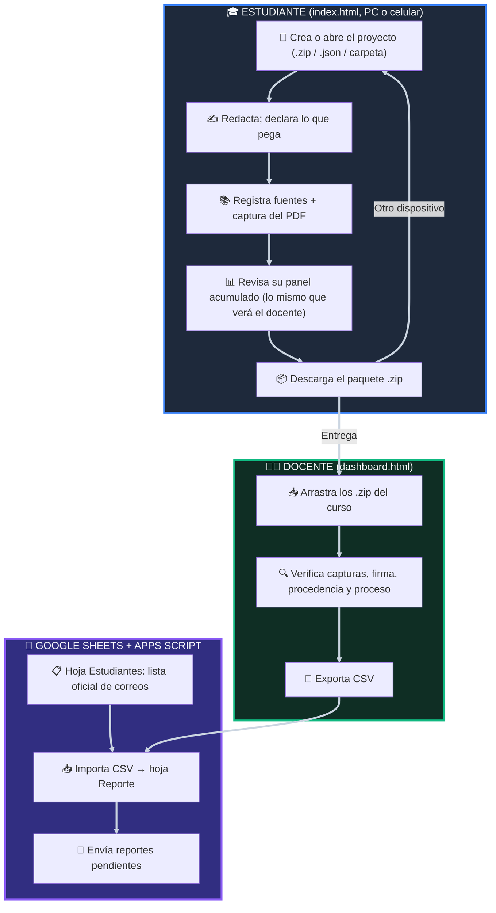

# 🔭 Eye on the Sky (Ojo en el Cielo) 🛰️
### *Plataforma de Escritura Académica Incremental, Citación Científica, Biometría de Redacción y Auditoría Docente sin Servidor*

<p align="center">
  
  
  
  
  
  
  
  
</p>

---


## 🧭 Tabla de Contenidos

- [🎯 1. ¿Qué es Eye on the Sky?](#-1-qué-es-eye-on-the-sky)
- [✨ 2. Características Principales](#-2-características-principales)
- [🔄 3. Flujo de Trabajo General](#-3-flujo-de-trabajo-general)
- [🚀 4. Instalación y Puesta en Marcha](#-4-instalación-y-puesta-en-marcha)
- [🎓 5. Manual del Estudiante (Editor)](#-5-manual-del-estudiante-editor)
- [👨‍🏫 6. Manual del Docente (Dashboard de Auditoría)](#-6-manual-del-docente-dashboard-de-auditoría)
- [☁️ 6bis. Registro del curso en Google Sheets (en vivo)](#️-6bis-registro-del-curso-en-google-sheets-en-vivo)
- [🧪 7. ¿Qué puede y qué no puede demostrar la telemetría?](#-7-qué-puede-y-qué-no-puede-demostrar-la-telemetría)
- [🛡️ 8. Integridad y Criptografía](#️-8-integridad-y-criptografía)
- [📂 9. Estructura de Archivos del Repositorio](#-9-estructura-de-archivos-del-repositorio)
- [🌐 10. Requisitos y Compatibilidad](#-10-requisitos-y-compatibilidad)

---

## 🎯 1. ¿Qué es Eye on the Sky?

**Eye on the Sky** (*Ojo en el Cielo*) es un entorno de escritura académica ligero y autónomo para cursos de investigación, seminarios de tesis y talleres de grado. Funciona sin servidor: el estudiante trabaja en su navegador (PC o celular) y el docente analiza las entregas arrastrando los archivos al panel docente.

Persigue tres objetivos:
1. 🔍 **Hacer visible el proceso de escritura:** cuánto del texto final fue tecleado en el editor, cuánto se pegó, en cuántas sesiones, días y dispositivos se construyó, y cómo se corrigió.
2. 📖 **Asegurar el respaldo de las fuentes:** cada fuente puede llevar la captura de la página del PDF consultado, con una huella SHA-256 que permite al docente comprobar que la imagen entregada es la misma que se adjuntó.
3. 🤝 **Fomentar la honestidad declarada:** en lugar de castigar todo pegado, el estudiante puede declarar lo que pega (notas propias, cita textual, texto con IA). Lo declarado no se penaliza, pero el docente lo ve y tiene un presupuesto.

> [!NOTE]
> **Local-first:** sin base de datos, sin costos mensuales. El trabajo se guarda en el navegador del estudiante (y, en PC, opcionalmente en una carpeta). Para cambiar de dispositivo o entregar se usa un **paquete .zip** que contiene el documento y todas sus capturas.

---

## ✨ 2. Características Principales

| Módulo | Funcionalidad |
| :--- | :--- |
| 📝 **Editor** | Editor enriquecido (Quill 1.3.7) con títulos H1–H5, sangrías, listas, tablas, índice (TOC), bibliografía, modo claro/oscuro y paginación visual. |
| 🎨 **Procedencia del texto** | Cada fragmento lleva un color de origen: tecleado (sin color), notas propias, cita textual, IA declarada, pegado sin declarar y referencia bibliográfica. "Limpiar formato" **no** borra estos colores. |
| 📋 **Pegados declarados** | Todo pegado de 12 palabras o más (en cualquier momento) abre una ventana para declararlo. Cortar y pegar dentro del propio documento se reconoce como reubicación y no cuenta como pegado. |
| 📊 **Panel acumulado** | "Actividad y Salud" muestra las cifras de **todas las sesiones en todos los dispositivos** y la lista exacta de observaciones que verá el docente. |
| ✍️ **Proceso de escritura** | Tasa de revisión, ediciones no lineales, pausas de reflexión y tiempo de tecleo efectivo por sesión, más una línea de tiempo del crecimiento del documento. |
| 🔒 **Ritmo de tecleo** | Huella de permanencia/vuelo de teclas, **solo con teclado físico** y por sesión. Es informativa, no una prueba de identidad. |
| 📸 **Capturas portables** | Imágenes guardadas en el almacén del navegador (IndexedDB) y en `capturas/` si hay carpeta; se insertan como imagen real en el documento y viajan dentro del paquete .zip con su huella SHA-256. |
| 📦 **Paquete .zip** | Documento + capturas en un solo archivo, para cambiar de dispositivo y para entregar. |
| 🏷️ **Bibliografía** | DOI (Crossref) y BibTeX; citas y bibliografía en Chicago (notas), Chicago (autor-fecha), APA 7 y MLA 9. |
| 📊 **Dashboard** | Carga en lote de .zip/.json, verificación de capturas y firma, gráficos de procedencia y crecimiento, detalle de pegados con fragmento, exportación CSV. |
| 📧 **Correo masivo** | `codigo_apps_script.gs`: importa el CSV en Google Sheets y envía a cada estudiante su reporte gráfico usando tu lista oficial de correos. |
| 📄 **Exportación** | PDF (impresión), Word (.docx con imágenes y tablas), Zotero (.ris), paquete .zip y .json. |

---

## 🔄 3. Flujo de Trabajo General



---

## 🚀 4. Instalación y Puesta en Marcha

No requiere `npm install`, servidor ni base de datos.

- **🟢 GitHub Pages (recomendado):** sube el repositorio y activa GitHub Pages. Los estudiantes usan la URL desde cualquier dispositivo y la app funciona sin conexión gracias al Service Worker (`sw.js`).
- **🟡 Live Server:** clic derecho sobre `index.html` › *Open with Live Server*.
- **🔵 Doble clic en `index.html`:** funciona, pero algunos navegadores limitan IndexedDB y el Service Worker con `file://`; para uso real publica en una URL.

> [!IMPORTANT]
> El almacén del navegador (texto y capturas) pertenece a **una URL concreta en un navegador concreto**. Si el estudiante cambia de URL, de navegador o borra los datos del sitio, debe abrir su paquete .zip para recuperar el trabajo.

---

## 🎓 5. Manual del Estudiante (Editor)

### 📁 5.1. Abrir, crear y continuar un proyecto

Al iniciar, la ventana de bienvenida ofrece:
- ✨ **Crear nuevo documento.** En PC (Chrome/Edge) puede vincularse a una carpeta; en celulares se crea directamente en el navegador. Se pide **nombre y correo** del autor (el docente los usa para identificar la entrega y enviar el reporte).
- 📂 **Abrir carpeta de proyecto (solo PC):** abre el `.json` o `.zip` **más reciente** de la carpeta (según su fecha de guardado interna) y guarda de vuelta en ese mismo archivo. Las capturas se sincronizan con la subcarpeta `capturas/`.
- 📄 **Abrir proyecto existente (.zip o .json):** en Chrome/Edge de PC se pide permiso de escritura y, si se concede, **el autoguardado actualiza ese mismo archivo**. En celulares el proyecto pasa al almacén del navegador.
- 📋 **Rescate:** pegar el texto de un `.json` (sin capturas).

Al recargar la página dentro de 30 minutos en el mismo dispositivo, **se continúa la misma sesión** (no se crea una sesión nueva).

### 🔁 5.2. Trabajar en varios dispositivos

1. Al terminar en un dispositivo: **Exportar › Paquete del proyecto (.zip)** (en celular: menú ☰ › *Descargar paquete*).
2. En el otro dispositivo: **Abrir proyecto** y elegir ese **.zip sin descomprimirlo**. El texto, la telemetría y las capturas se restauran y los enlaces de las imágenes siguen funcionando.
3. Para volver, repetir con el paquete más nuevo.

Protecciones:
- Si se abre una versión **anterior** del mismo proyecto, la app avisa antes de reemplazar la más nueva.
- Si las dos versiones **se separaron** (se trabajó en ambos dispositivos sin llevar el archivo), avisa cuántas sesiones se perderían.
- El celular nombra las descargas repetidas `archivo (1).zip`, `archivo (2).zip`…: elige siempre la más reciente.

### 📊 5.3. Panel "Actividad y Salud" (acumulado)

Calculado con `analytics.js`, **el mismo módulo que usa el panel docente**:
- **Texto tecleado por ti:** porcentaje del texto que **queda en el documento** escrito en el editor, sumando todas las sesiones y dispositivos, con el desglose por procedencia.
- **Lo que verá tu docente:** la lista exacta de observaciones.
- **Total del proyecto:** sesiones, días, palabras tecleadas, pegados declarados y sin declarar, tasa de revisión, fuentes con captura, dispositivos.
- **Sesión actual:** palabras, pegados, tiempo y dispositivo.
- **Autor del trabajo:** nombre y correo.

### 🎨 5.4. Colores de procedencia

| Color | Significado | Efecto |
| :--- | :--- | :--- |
| ⚪ Sin color | Tecleado en el editor | Suma al "texto tecleado". |
| 🔵 Azul | Notas propias declaradas | No penaliza; presupuesto 35 % del documento. |
| 🟢 Verde azulado | Cita textual declarada (vinculada a una fuente) | No penaliza; presupuesto 15 %. |
| 🟠 Ámbar | Texto con IA declarado | Se reporta; presupuesto 10 % (más es alerta crítica). |
| 🔴 Rojo | Pegado sin declarar | Advertencia desde 8 %, crítica desde 20 %. |
| 🟣 Púrpura | Referencia bibliográfica insertada | Neutra. |

Los límites están en `POLICY` dentro de `analytics.js` y el docente puede ajustarlos. El texto que se escribe a continuación de un tramo coloreado no hereda el color, y **"Limpiar formato" (Tx) conserva los colores**. El botón "Ocultar" del panel los oculta solo visualmente.

### 📋 5.5. Pegados, inserciones y reubicaciones

- **Pegado de 12 palabras o más** (Ctrl+V, menú del celular, arrastrar y soltar, pegado dentro de una tabla): se marca en rojo y se abre la ventana **"¿Qué acabas de pegar?"** con el fragmento. Al declararlo cambia de color; con "No declarar" queda rojo.
- **Pegados cortos** (una palabra, un DOI): se registran como pegado sin declarar, sin ventana.
- **Cortar/copiar y pegar dentro del documento:** se reconoce como reubicación de texto propio y conserva su color original.
- **Deshacer/Rehacer (Ctrl+Z / Ctrl+Y)** no cuenta como escritura ni como pegado.
- Citas, índice, bibliografía, tablas y capturas insertadas por la app no cuentan como escritura ni como pegado.

### 🔒 5.6. Ritmo de tecleo (indicador informativo)

Mide la permanencia en tecla (*dwell*) y la pausa entre teclas (*flight*). Se calibra con 250 pulsaciones con **teclado físico** y luego compara cada sesión (mínimo 25 pulsaciones). En pantallas táctiles **no se mide** (el teclado virtual no da tiempos comparables y en Android suele no identificar las teclas). Los atajos con Ctrl no se cuentan. Umbrales: ≥ 75 % consistente, 60–74 % variación moderada, < 60 % advertencia.

### 🔊 5.7. Sonidos

Carpeta `sounds/` (en minúsculas): `session_start.mp3`, `milestone_words.mp3`, `source_captured.mp3`, `autosave_peace.mp3`, `paste_alert.mp3`, `export_success.mp3`. Los hitos (100, 250, 500… palabras) solo suenan al cruzarlos, no al abrir un documento que ya los superó.

### 📚 5.8. Fuentes y citas

- **DOI (Crossref)** o **BibTeX** (individual o en lote).
- Estilos por fuente: **Chicago nota** (`Nombre Apellido, "Título," Revista (Año), pág.`), **Chicago autor-fecha** (`(Apellido Año, pág.)`), **APA 7** (`(Apellido, Año, p. pág.)`) y **MLA 9** (`(Apellido pág.)`).
- **Bibliografía:** se genera en el estilo más usado por las fuentes, ordenada por apellido, con el título correspondiente (Bibliografía / Referencias / Obras citadas).

### 📸 5.9. Capturas de evidencia

- Al registrar una fuente se puede adjuntar la captura de la página del PDF consultado. **Funciona en celulares y en PC.**
- El botón **Captura** inserta una imagen real en el documento con un pie opcional.
- Cada imagen se reduce a 1600 px como máximo, recibe un nombre estable (`cap_AAAAMMDDhhmmss_xxxxx.jpg`) y una huella SHA-256 registrada en `captures` del proyecto.
- Si una captura no está en el dispositivo actual, se marca **"⚠ no disponible"**; al hacer clic se puede volver a adjuntar. Si la imagen no es idéntica a la original, queda registrada como **reemplazo** y el docente lo ve.

### 💾 5.10. Guardado

- Autoguardado **cada 15 segundos** si hay cambios, al cambiar de pestaña y al cerrar.
- Siempre en el almacén del navegador; además en la carpeta vinculada o en el archivo abierto con permiso de escritura (un paquete .zip abierto así se reescribe como máximo cada 60 s).
- <kbd>Ctrl</kbd> + <kbd>S</kbd> guarda y muestra las estadísticas acumuladas.

### 📦 5.11. Exportaciones

- **Paquete del proyecto (.zip):** `proyecto.json` + `capturas/` + `LEEME.txt`. **Es el formato para cambiar de dispositivo y para entregar.**
- **Solo datos (.json):** sin capturas (avisa si el proyecto tiene capturas).
- **PDF:** impresión del navegador (los colores de procedencia no se imprimen).
- **Word (.docx):** con capturas como imágenes, tablas y bibliografía (solo se agrega si el documento no la tiene).
- **Zotero (.ris).**

### 📱 5.12. Interfaz en PC y celular

En pantallas de 769 px o más, la barra superior reúne las herramientas y el menú ☰ abre un panel lateral. En celulares hay accesos directos a Fuentes, Índice y Actividad, y los paneles se superponen al lienzo (se cierran solos al girar el teléfono o abrir el teclado para dejar más espacio de escritura).

---

## 👨‍🏫 6. Manual del Docente (Dashboard de Auditoría)

### 📥 6.1. Carga

Arrastra los **paquetes .zip** del curso (también acepta `.json`). Con el .zip, cada captura se verifica contra su huella SHA-256: *verificada*, *reemplazada por el estudiante*, *no coincide*, *falta en el paquete* o *sin huella (versión anterior)*. Si el mismo proyecto llega dos veces, se conserva la versión más reciente.

### 📊 6.2. Vista del curso

Indicadores agregados, gráfico de **procedencia del texto final** por estudiante (apilado al 100 %) y gráfico de sesiones y días. La tabla muestra correo, sesiones y dispositivos, % tecleado, % sin declarar, fuentes con captura (y capturas verificadas), palabras, ritmo de tecleo y alertas.

### 🔍 6.3. Detalle del estudiante

- Alertas e indicios.
- Barra de procedencia del texto final.
- **Crecimiento del documento en el tiempo** con los pegados marcados.
- **Proceso de escritura:** tasa de revisión, ediciones no lineales, pausas y tiempo efectivo.
- **Pegados registrados** con fecha, tipo declarado, fuente (en citas textuales) y fragmento.
- Dispositivos utilizados, ritmo de tecleo, fuentes con miniatura de la captura e historial de sesiones.

### 🚨 6.4. Alertas (mismas reglas que ve el estudiante)

| Nivel | Alerta | Regla (`analytics.js › POLICY`) |
| :---: | :--- | :--- |
| 🚨 | Documento en 1 sola sesión | > 200 palabras propias (sin contar lo declarado) en 1 sesión |
| ⚠️ | Pocas sesiones | ≤ 2 sesiones con > 600 palabras propias |
| ⚠️ | Salto atípico | > 400 palabras netas no declaradas a > 65 palabras/min |
| ⚠️ | Pocos días | > 1000 palabras en 1 día |
| 🚨/⚠️ | Pegado sin declarar | ≥ 20 % / ≥ 8 % del texto final |
| ⚠️ | Poco texto tecleado | < 40 % del texto final (con ≥ 150 palabras) |
| ⚠️ | Presupuestos de lo declarado | Notas > 35 %, citas textuales > 15 % |
| 🚨 | IA declarada sobre el límite | > 10 % |
| ⚠️ | Patrón de transcripción | ≥ 3000 car. tecleados con teclado, revisión < 4 % y < 1 edición no lineal por 1000 car. |
| ⚠️ | Ritmo de tecleo | Alguna sesión con teclado < 60 % de consistencia |
| 🚨/⚠️ | Fuentes y capturas | Sin fuentes / ninguna con captura / menos de la mitad |
| 🚨/⚠️ | Capturas del paquete | No coinciden con su huella / faltan |
| ⚠️ | Integridad | La firma del JSON no coincide |

Los archivos de versiones anteriores (sin procedencia por fragmento) se evalúan con el método antiguo basado en eventos y se marcan como "estimado".

### 📑 6.5. CSV

Columnas: Estudiante, Correo, ID proyecto, Título, Sesiones, Días activos, Dispositivos, Total palabras, % Tecleado, % Pegado sin declarar, % Notas declaradas, % Citas textuales, % IA declarada, Pegados sin declarar, Pegados declarados, Tasa de revisión, Minutos de tecleo, Fuentes totales, Fuentes con captura, Fuentes citadas, Capturas verificadas, Huella biométrica, Biometría última y mínima, Nivel de alerta, Alertas, Integridad JSON, Último guardado. UTF-8 con BOM (Excel y Google Sheets).

### 📧 6.6. Envío de reportes con Google Sheets + Apps Script

1. En tu Google Sheets: **Extensiones › Apps Script**, pega `codigo_apps_script.gs`, guarda y recarga.
2. **🎓 Eye on the Sky › ⚙️ Preparar hojas.** Crea:
   - **`Estudiantes`**: tu **lista oficial** (columnas `Estudiante` y `Correo`).
   - **`Reporte`**: se llena al importar el CSV.
3. **📥 Importar CSV del panel docente** (elige el archivo exportado). Se conserva el estado de envío de importaciones anteriores.
4. **👁️ Vista previa** / **🧪 Enviarme una prueba** sobre una fila.
5. **📧 Enviar reportes pendientes.**

Reglas de envío: se usa el correo de la hoja `Estudiantes` cuyo nombre coincida (sin distinguir tildes ni mayúsculas). Si no coincide, el correo escrito por el estudiante en el editor **solo si figura en la lista** (configurable con `SOLO_CORREOS_DE_LA_LISTA`). Un mismo reporte no se reenvía; si las métricas cambian en una nueva importación, la fila vuelve a quedar pendiente. Se respeta la cuota diaria de Gmail (100 correos en cuentas gratuitas, 1500 en Workspace). El correo usa tablas y estilos en línea, compatibles con Gmail y Outlook.

### 🧪 6.7. Estudiantes demo

`estudiantes_demo/` incluye 6 casos en formato antiguo (se evalúan por eventos):

| Archivo | Caso |
| :--- | :--- |
| `estudiante_1_sofia_morales_impecable.json` | Proceso incremental sin alertas |
| `estudiante_2_mateo_rios_sospecha_suplantacion.json` | Sesión con ritmo de tecleo muy distinto (advertencia informativa) |
| `estudiante_3_lucas_peralta_copia_pega.json` | Pegado masivo en una sola sesión, sin capturas |
| `estudiante_4_valeria_castillo_una_sesion.json` | Documento completo en una sesión |
| `estudiante_5_diego_torres_json_alterado.json` | Firma JSON alterada |
| `estudiante_6_camila_vargas_divergencia_leve.json` | Variación leve de ritmo y pocas capturas |

---

## ☁️ 6bis. Registro del curso en Google Sheets (en vivo)

Opcional pero recomendado. Convierte una hoja de cálculo del docente en la "base de datos" del curso **sin servidores propios ni costos**: cada docente instala su copia en su propio Google Drive.

### Cómo funciona
- El estudiante inicia sesión con su **carnet de identidad** y una **contraseña** generada por el script y enviada a su correo.
- Cada **sesión de trabajo** (en cualquier dispositivo) se registra como **una fila** de la hoja `Sesiones`. Si se recarga la página después de más de 30 minutos, o desde otro dispositivo, se crea una fila nueva.
- Con cada envío, el script recalcula la fila del estudiante en `Resumen` con **las mismas reglas** de `analytics.js` (el archivo se copia tal cual al proyecto de Apps Script).
- Sin conexión, las sesiones esperan en una cola del dispositivo y se envían al volver internet.
- **El texto del trabajo y las capturas no se envían nunca**: siguen en el dispositivo y en el paquete .zip.

### Actualización sin recargar
Apps Script no puede "empujar" datos al navegador, así que el navegador **pregunta periódicamente** (valores en `config.js`):
- Editor del estudiante: envía su sesión como máximo cada 60 s y consulta su estado cada 3 min con la pestaña visible. Si aparece una observación nueva sobre **su propio** trabajo, se enciende un punto en el botón de Actividad y Salud.
- Docente: el panel docente (botón **En vivo**) consulta cada 60 s. Las alertas nuevas encienden un **punto rojo** en "En vivo" y en el botón "Panel Docente" del editor **solo en los navegadores donde está guardada la clave docente**. Al abrir el detalle de un estudiante, sus alertas quedan marcadas como vistas.
- Si ninguna página del docente está abierta, los datos se siguen acumulando en la hoja; también puede consultarse directamente la hoja `Resumen`.

### Qué se guarda en cada fila de `Sesiones`
| Grupo | Columnas |
| :--- | :--- |
| Identificación | Recibido, Carnet, Estudiante, ID proyecto, Título, ID sesión, N.º sesión |
| Tiempo | Inicio, Fin, Duración (min), Minutos de tecleo |
| Dispositivo | Dispositivo, Entrada (teclado/táctil), ID dispositivo, Versión app |
| Avance | Palabras al inicio, Palabras al final, Cambio neto, Palabras tecleadas |
| Proceso | Car. tecleados, Car. borrados, Tasa de revisión, Ediciones no lineales, Pausas 2-30 s |
| Pegados | Sin declarar / Notas / Citas textuales / IA declarada (cantidad y caracteres de cada tipo) |
| Documento al sincronizar | % tecleado, % notas, % citas, % IA, % sin declarar, Fuentes, Fuentes con captura, Capturas |
| Biometría | Muestras, Consistencia (solo teclado físico) |
| Detalle (JSON) | La sesión completa compacta: pegados con fragmento de ≤ 160 caracteres, línea de tiempo (≤ 150 puntos), etc. Siempre < 45 000 caracteres |
| Instantánea (JSON) | Conteos de procedencia y fuentes usados para calcular el resumen |

### Seguridad y privacidad
- Las contraseñas se guardan como huella SHA-256 con un secreto del script (nunca en texto). El estudiante recibe un **token firmado** válido 180 días; regenerar su contraseña invalida sus tokens.
- 6 intentos fallidos por carnet bloquean el inicio de sesión durante 15 minutos.
- Un estudiante solo puede leer su propio estado y no puede escribir sesiones de otro carnet.
- La clave docente y el secreto viven en las *Propiedades del script*, no en el código público.
- El carnet de identidad es un dato personal: la hoja debe quedar **privada** en el Drive del docente. Informa a los estudiantes qué se registra.

### Instalación
Sigue los pasos del encabezado de `codigo_apps_script.gs` (también en el panel docente › "Enviar correos (Apps Script)"). En resumen: hoja nueva › pegar `codigo_apps_script.gs` y `analytics.js` › ⚙️ Preparar hojas › pegar la lista (Carnet, Estudiante, Correo) › publicar como aplicación web › copiar la URL en `config.js` › 🔑 Generar contraseñas › 🔐 Ver clave docente › conectar el panel con **En vivo**.

> [!NOTE]
> Con `WEB_APP_URL` vacío en `config.js`, todo funciona como antes, sin servidor (paquete .zip + CSV).

---

## 🧪 7. ¿Qué puede y qué no puede demostrar la telemetría?

**Sirve como evidencia del proceso, no como prueba de autoría.**

| Detecta bien | No detecta |
| :--- | :--- |
| Copiar y pegar masivo sin declarar | Copiar a mano (teclear) un texto generado por IA que se lee en otra pantalla, salvo como "patrón de transcripción" (indicio débil) |
| Documentos hechos en una sola sesión o noche | Programas que simulan pulsaciones de teclado |
| Capturas cambiadas después de adjuntarlas | Que otra persona escriba en la cuenta del estudiante con un ritmo parecido |
| Pegados de IA declarados por el estudiante | Edición manual del JSON por alguien que lea `editor.js` (la clave de firma es pública) |

Recomendación de uso:
1. Usa las métricas para **decidir con quién conversar**, no para sancionar.
2. La validación más sólida es humana: pide al estudiante que explique o reescriba en clase un párrafo elegido al azar, o que muestre cómo llegó a una idea.
3. Fomenta la declaración: es preferible un 10 % de IA declarada que un 0 % falso.
4. Pide entregas parciales en fechas distintas: el crecimiento del documento entre entregas es difícil de falsificar.

---

## 🛡️ 8. Integridad y Criptografía

- Cada guardado calcula una firma SHA-256 del proyecto (`_signature`) con una clave fija de la aplicación. **Detecta ediciones manuales casuales del JSON**, pero no es criptografía fuerte: la clave está en el código público.
- Cada captura tiene su huella SHA-256 (`captures[nombre].sha256`); el panel docente la recalcula desde el .zip.

---

## 📂 9. Estructura de Archivos del Repositorio

```plaintext
app-eye-on-the-sky/
├── config.js                # ÚNICO archivo a editar por cada docente (URL del Apps Script)
├── index.html               # Editor del estudiante
├── cloud.js                 # Inicio de sesión, envío de sesiones, cola sin conexión, avisos en vivo
├── editor.js                # Lógica del editor (Quill, guardado, telemetría, pegados, capturas)
├── analytics.js             # Métricas y alertas COMPARTIDAS por editor y dashboard (POLICY)
├── captures.js              # Almacén portable de capturas (IndexedDB, compresión, SHA-256)
├── dashboard.html           # Panel docente
├── dashboard.js             # Carga de .zip/.json, verificación, gráficos, CSV
├── codigo_apps_script.gs    # Apps Script: hojas, contraseñas, servicio web, resumen y correos
├── styles.css               # Estilos (claro/oscuro, procedencia, impresión)
├── sw.js                    # Service Worker (uso sin conexión)
├── manifest.json, icon.svg  # Aplicación instalable (PWA)
├── sounds/                  # Efectos de sonido
└── estudiantes_demo/        # 6 proyectos de ejemplo
```

Formato del paquete `.zip`: `proyecto.json` + `capturas/<nombre>` + `LEEME.txt`.

---

## 🌐 10. Requisitos y Compatibilidad

| Navegador | Editor | Guardado | Capturas | Carpeta local / guardar en el mismo archivo |
| :--- | :---: | :---: | :---: | :---: |
| Chrome / Edge en PC | ✅ | Navegador + carpeta o archivo | ✅ | ✅ |
| Firefox / Safari en PC | ✅ | Navegador | ✅ | ❌ (usar paquete .zip) |
| Android (Chrome) | ✅ | Navegador | ✅ | ❌ (usar paquete .zip) |
| iPhone / iPad (Safari, Chrome) | ✅ | Navegador | ✅ | ❌ (usar paquete .zip) |

La primera carga necesita conexión para descargar Quill, JSZip y docx; después funciona sin conexión.

---

## 🤝 11. Contribuciones y Soporte

Las sugerencias, mejoras y reportes de errores son bienvenidos:
1. Haz un **Fork** de este repositorio.
2. Crea una rama para tu característica: `git checkout -b feature/nueva-mejora`.
3. Haz commit de tus cambios: `git commit -m 'feat: Agregar nueva funcionalidad'`.
4. Haz push a la rama: `git push origin feature/nueva-mejora`.
5. Abre un **Pull Request**.

---

<p align="center">
  <b>Eye on the Sky</b> • Desarrollado con ❤️ para docentes y estudiantes de investigación.<br>
  <i>Fomentando la honestidad académica y el rigor científico sin barreras tecnológicas ni servidores intermedios.</i>
</p>
